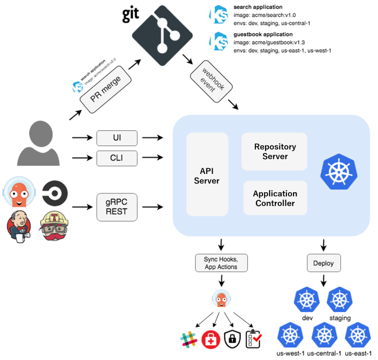

# ArgoCD Installation and Deployment Guide

## Prerequisites

- A running Kubernetes cluster
- `kubectl` command-line tool installed and configured
- `helm` command-line tool installed
- `argocd` command-line tool installed 

## Architecture Overview




## Installing ArgoCD

1. **Create the `argocd-system` namespace:**

    ```sh
    kubectl create namespace argocd-system
    ```

2. **Install ArgoCD using the official manifests:**

    ```sh
    helm install argo argo/argo-cd -n argocd-system
    ```

3. **Wait for the ArgoCD components to be up and running:**

    ```sh
    kubectl get pods -n argocd-system
    ```

4. **Access the ArgoCD API server:**

    - **Port-forward the ArgoCD server:**

        ```sh
        kubectl port-forward svc/argocd-server -n argocd 8080:80
        ```

    - **Open your browser and navigate to `http://localhost:8080`**

5. **Login to ArgoCD:**

    - **Get the initial admin password:**

        ```sh
        kubectl get secret argocd-initial-admin-secret -n argocd -o jsonpath="{.data.password}" | base64 -d;echo
        ```

    - **Login using the username `admin` and the password retrieved above.**

## Deploying Applications

0. **Login to the ArgoCD server using the CLI:**

    ```bash
    argocd login http://localhost:8080 --username admin --insecure
    ```

1. **Create a new application in ArgoCD:**

    - **Using the ArgoCD CLI:**

        ```bash
        argocd app create <app-name> \
        --repo <repository-url> \
        --path <path-to-manifests> \
        --dest-server https://kubernetes.default.svc \
        --dest-namespace <namespace>
        ```

    - **Using the ArgoCD Web UI:**

        - Navigate to `https://localhost:8080`
        - Click on `New App`
        - Fill in the required details:
            - Application Name
            - Project
            - Sync Policy
            - Repository URL
            - Path to manifests
            - Destination Cluster and Namespace
        - Click `Create`

    - **Using the ArgoCD Manifest Files:**

    ```yaml
    apiVersion: argoproj.io/v1alpha1
    kind: Application
    metadata:
      name: example-app
      namespace: argocd-system
    finalizers:
    - resources-finalizer.argocd.argoproj.io
    spec:
      destination:
        namespace: default
        name: in-cluster
      project: default
      source:
        chart: keycloak
        repoURL: registry-1.docker.io/bitnamicharts
        targetRevision: 24.2.1
        helm:
          releaseName: keycloak
      syncPolicy: # Automate syncing the application through configuration
        automated: 
          selfHeal: true
    ```

2. **Sync the application to deploy the resources:**

    - **Using the ArgoCD CLI:**

        ```sh
        argocd app sync <app-name>
        ```

    - **Using the ArgoCD Web UI:**

        - Navigate to the application details page
        - Click `Sync`
        - Confirm the sync operation

## Example Deployment

To deploy the files in the current directory, you can use the following steps:

1. **Create a new application:**

    ```sh
    argocd app create example-app \
    --repo <repository-url> \
    --path argocd-examples \
    --dest-server https://kubernetes.default.svc \
    --dest-namespace default
    ```

2. **Sync the application:**

    ```sh
    argocd app sync example-app
    ```

This will deploy the resources defined in the `argocd-examples` directory to the `default` namespace in your Kubernetes cluster.

## Additional Resources

- [ArgoCD Documentation](https://argo-cd.readthedocs.io/)
- [ArgoCD GitHub Repository](https://github.com/argoproj/argo-cd)
