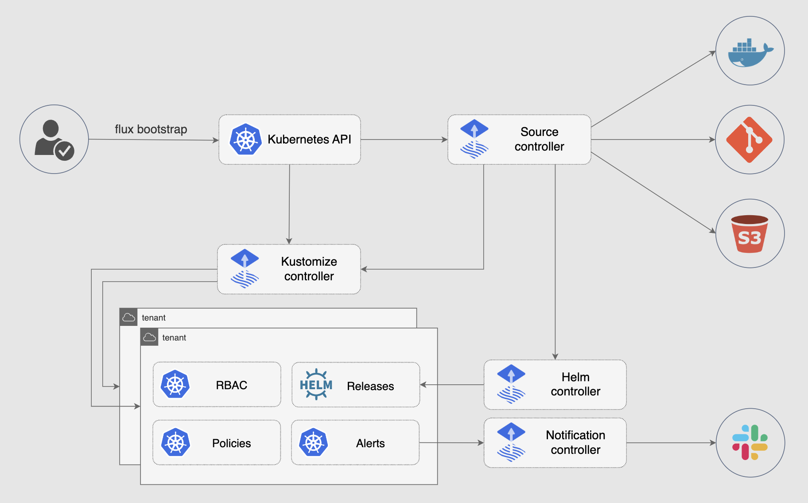

# FluxCD v2 Setup and Deployment Guide

This guide will walk you through the setup of FluxCD v2 and the deployment of resources in this repository.

## Prerequisites

- Kubernetes cluster (v1.16+)
- kubectl (v1.18+)
- GitHub account
- Flux CLI (v0.12+)

## Architecture Overview



## Setup FluxCD v2

1. **Install Flux CLI**

    ```bash
    brew install fluxcd/tap/flux
    ```

    Or download the binary from the [releases page](https://github.com/fluxcd/flux2/releases).

2. **Bootstrap and Install Flux using Helm**

    ```bash
    helm install -n flux-system --create-namespace flux oci://ghcr.io/fluxcd-community/charts/flux2
    ```

## Deploy Resources

1. **Create a GitRepository Source**

    ```yaml
    apiVersion: source.toolkit.fluxcd.io/v1beta1
    kind: GitRepository
    metadata:
      name: flux-system
      namespace: flux-system
    spec:
      interval: 1m0s
      url: https://github.com/<GITHUB_USER>/<REPO>
      branch: main
      secretRef:
         name: flux-system
    ```

2. **Create a Kustomization**

    ```yaml
    apiVersion: kustomize.toolkit.fluxcd.io/v1beta1
    kind: Kustomization
    metadata:
      name: flux-system
      namespace: flux-system
    spec:
      interval: 10m0s
      path: "./clusters/my-cluster"
      prune: true
      sourceRef:
         kind: GitRepository
         name: flux-system
    ```

3. **Apply the Manifests**

    ```bash
    kubectl apply -f ./clusters/my-cluster
    ```

4. **Create a HelmRepository Source**

    ```yaml
    apiVersion: source.toolkit.fluxcd.io/v1
    kind: HelmRepository
    metadata:
      name: my-helm-repo
      namespace: flux-system
    spec:
      interval: 1m0s
      url: https://charts.example.com/
    ```

5. **Create a HelmRelease**

    ```yaml
    apiVersion: helm.toolkit.fluxcd.io/v2
    kind: HelmRelease
    metadata:
      name: my-helm-release
      namespace: flux-system
    spec:
      interval: 5m0s
      chart:
      spec:
        chart: my-chart
        sourceRef:
        kind: HelmRepository
        name: my-helm-repo
        version: "1.2.3"
      values:
      replicaCount: 2
      image:
        repository: my-image
        tag: "1.0.0"
    ```

3. **Apply the Manifests**

    ```bash
    kubectl apply -f ./clusters/my-cluster
    ```

## Monitoring and Troubleshooting

- **Check Flux Logs**

  ```bash
  kubectl logs -n flux-system deploy/flux
  ```

- **Get Kustomization Status**

  ```bash
  flux get kustomizations
  ```

## Conclusion

You have successfully set up FluxCD v2 and deployed resources to your Kubernetes cluster. For more information, visit the [FluxCD documentation](https://fluxcd.io/docs/).
